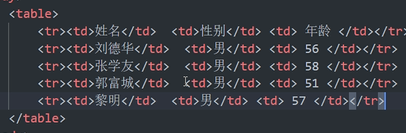
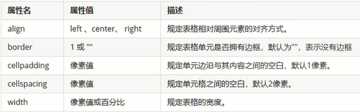

# 第二篇笔记

表格：用于显示、展示数据；不是用来布局页面的。

表格的基本语法： <table>   </table>    是用来定义表格的标签。

<tr></tr>定义表格中的行。

<td></td>定义表格中的单元格，必须嵌套在<tr></tr>中；td指表格数据。单元格内可以放任何元素。

表头单元格标签 ：位于单元格的第一行或第一列，表头单元格的文本会加粗居中显示。<th></th>是表头部分。

表格属性：

